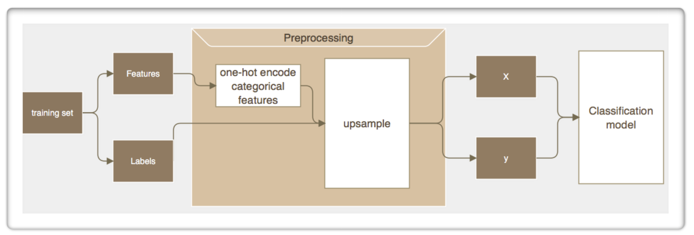
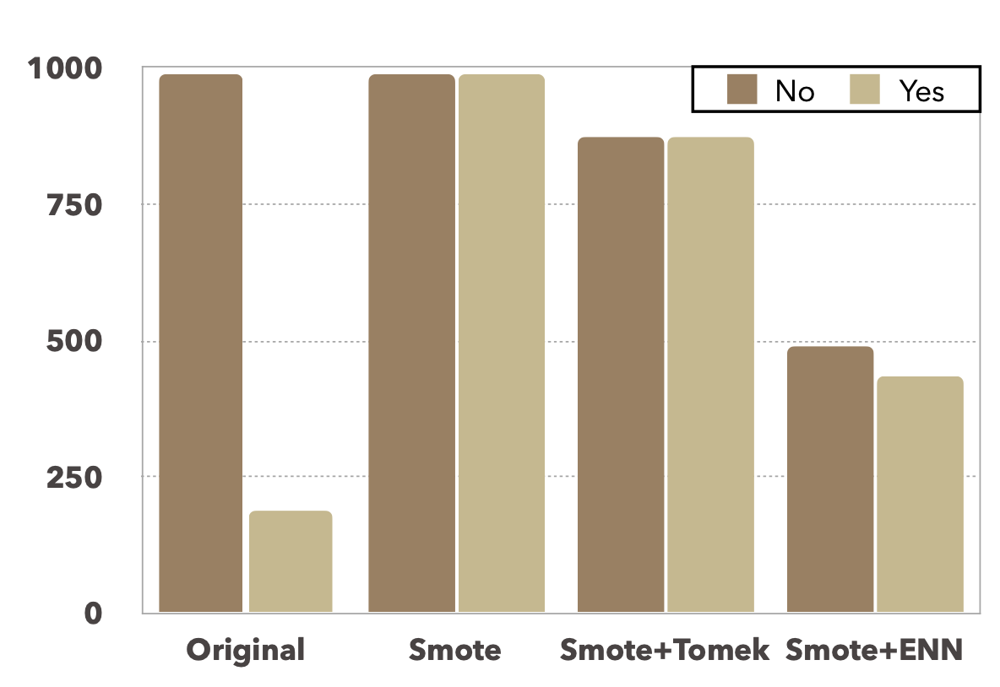
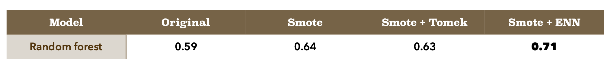
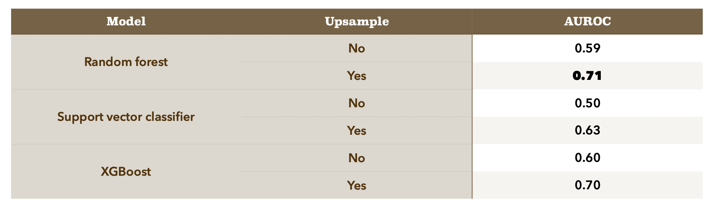

# Emplyee Attrition Prediction
This is a machine learning project aims to predict whether a employee will stay in company or not based on several individual-related attributes. The model used here is Random Frorest along with upsampled data.
Besides, this is a homework during Data Mining Course.
  
Full report in Chinese is in **"report"** folder.
  
Project are done in Dec. 2020
  
## Overall Workflow
 
  
## Metric
The data is obviously imblance which "Yes" label is relative few, so the accuracy score may have a little bias. Here I implement **AUROC** as our metric.
  
## Upsample
I've done upsampling to balance data. Here I tried three different kinds of upsampling method (see Reference [1]).Unsample is using "imblearn" library in Python. Data size analysis by class is in below table.
  
Below is the performance of Random Forest with differernt kinds of upsampled data. As a result, I choose **Tomek + ENN** as my upsampling method.
  
Upsample data may lower overall accuracy, but the small class is predicted better. So it's worth to lower a little accuracy to increase AUROC.
  
## Model Comparison
I've tried three models: Random Forest, Support Vector Classifier, XGBoost. Below is the performance of these model with upsample and un-upsample data.
  
As a result, I choose Random Forest(RF) as my model.
  
## Other Try
### PCA
Due to the data contains up to thirty attributes, I've tried to reduce dimension. But the performance is unwell as I tried to reduce to 2, 5, 10 conponents.
### RF parameters
I've tried tune some RF attributes such as max_depth, bootstrap, max_feature to avoid overfitting. Also I've looked up feature_importance to get the less important attribute and delete it. But the performance is nearly the same.
  
## Reference
[1]Gustavo E. A. P. A. Batista, Ronaldo C. Prati, and Maria Carolina Monard. 2004. **A study of the behavior of several methods for balancing machine learning training data**. SIGKDD Explor. Newsl. 6, 1 (June 2004), 20–29. DOI:https://doi.org/10.1145/1007730.1007735
